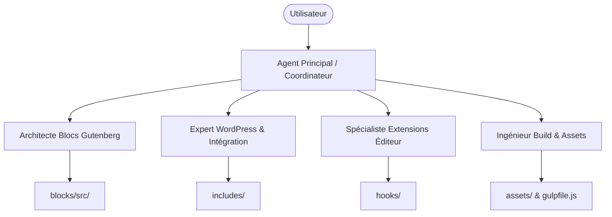

# Équipe d'Agents pour EO Blocks

Ce document définit l'organisation d'une équipe de sous-agents IA spécialisés pour le développement, la maintenance et l'évolution du plugin **EO Blocks**. Il répartit les responsabilités en fonction de la structure technique du projet.

---

## Rôles et Responsabilités des Agents

### 1. Architecte Blocs Gutenberg (`BlockAgent`)
*   **Rôle :** Création, modification et optimisation des blocs Gutenberg personnalisés.
*   **Périmètre de fichiers (Scope) :**
    *   Tout le dossier [blocks/src/](./blocks/src)
*   **Compétences clés :** React.js, API des Blocs WordPress (Gutenberg), `block.json` (metadata v3), CSS/SCSS modulaire par bloc, gabarits de rendu dynamique PHP (`render.php`), script frontend (`view.js`).
*   **Tâches types :**
    *   Créer un nouveau bloc (ex: `eo-testimonial`).
    *   Ajouter de nouveaux attributs dans `block.json` et les lier aux contrôles dans `edit.js`.
    *   Optimiser le rendu dynamique PHP dans le fichier `render.php` d'un bloc.

---

### 2. Expert WordPress & Intégration (`CoreAgent`)
*   **Rôle :** Gestion de la logique PHP globale, des réglages du plugin, des migrations de base de données et des communications avec les API externes (ex: Dolibarr).
*   **Périmètre de fichiers (Scope) :**
    *   [eo-blocks.php](./eo-blocks.php)
    *   Dossier [includes/](./includes)
*   **Compétences clés :** PHP orienté objet, API des Réglages WordPress (Settings API), requêtes API HTTP (`wp_remote_get`), requêtes SQL WordPress (`$wpdb`), gestion de la sécurité (nonces, rôles et capabilités, assainissement et échappement).
*   **Tâches types :**
    *   Ajouter un nouveau paramètre de configuration dans la classe [Eoblocks_Settings](./includes/class-eoblocks-settings.php).
    *   Modifier l'endpoint de recherche AJAX dans [api-eo-search.php](./includes/api-eo-search.php).
    *   Faire évoluer le helper de connexion à Dolibarr dans [class-eoblocks-helper.php](./includes/class-eoblocks-helper.php).

---

### 3. Spécialiste Extensions Éditeur (`HookAgent`)
*   **Rôle :** Extension des fonctionnalités des blocs WordPress natifs et gestion de l'expérience d'édition globale (hooks JS).
*   **Périmètre de fichiers (Scope) :**
    *   Dossier [hooks/src/](./hooks/src)
*   **Compétences clés :** Filtres JavaScript WordPress (`@wordpress/hooks`), Higher-Order Components (HOC) React, extension des contrôles Gutenberg de base (ex: inspecteur, contrôles de bloc).
*   **Tâches types :**
    *   Modifier ou étendre les attributs personnalisés injectés dans les blocs de groupe natifs [group-link.js](./hooks/src/group-link.js).
    *   Ajouter un nouveau contrôle dans la barre d'outils d'un bloc natif existant.

---

### 4. Ingénieur Build & Assets (`BuildAgent`)
*   **Rôle :** Maintenance des outils de développement, du pipeline de compilation CSS/JS et gestion des assets globaux (styles, scripts externes).
*   **Périmètre de fichiers (Scope) :**
    *   [gulpfile.js](./gulpfile.js)
    *   [package.json](./package.json)
    *   Dossier [assets/](./assets)
*   **Compétences clés :** Node.js/npm, Gulp, Webpack (via `@wordpress/scripts`), intégration de librairies tierces (comme Swiper).
*   **Tâches types :**
    *   Mettre à jour les dépendances npm dans [package.json](./package.json).
    *   Ajuster la tâche de build SCSS dans [gulpfile.js](./gulpfile.js).
    *   Intégrer ou mettre à jour un script ou une feuille de style tiers dans `assets/inc/` ou `assets/js/`.
